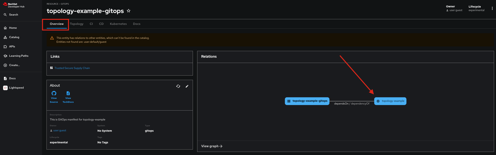

# **AI Software Template GitOps**

This repository contains the necessary content required for managing GitOps. It was created as part of an AI Software Template execution. The associated source component is available for reference in the **Overview** tab as described in the following image.

# **Deployed Resources**
During the template setup a custom model server was entered. Therefore, no model or model server was deployed by this application.

# **Application**

The AI Software Template that was executed comes with a sample application. This application will be built from https://github.com/ai-rolling-demo/chabot-maysun-test-3, stored in [quay.io/rhdhpai-rolling-demo/chabot-maysun-test-3](https://quay.io/rhdhpai-rolling-demo/chabot-maysun-test-3) and deployed through ArgoCD. 

This sample application is accessible through port 8501.